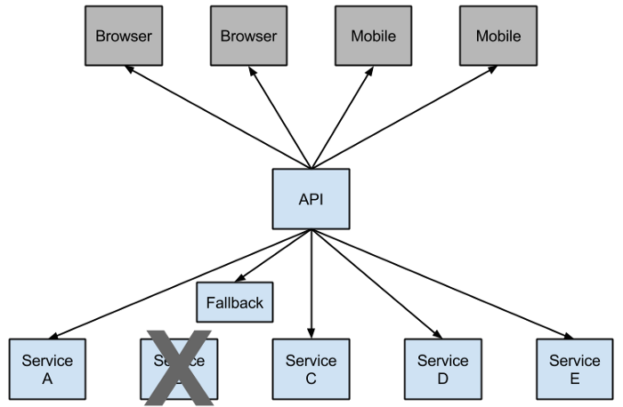

### Netflix Hystrix Fault Tolerance




http://localhost:8080/fault-tolerance-example


- add Hystrix dependency 
```
    <dependency>
        <groupId>org.springframework.cloud</groupId>
        <artifactId>spring-cloud-starter-netflix-hystrix</artifactId>
    </dependency>
```

- add @EnableHystrix annotation in springboot main class

```
    @SpringBootApplication
    @EnableHystrix
    public class LimitsServiceApplication {
    
        public static void main(String[] args) {
            SpringApplication.run(LimitsServiceApplication.class, args);
        }
    
    }
```

- add @HystrixCommand annotation to rest method for fault tolerance, also write fault tolerance method
```
    @GetMapping("/fault-tolerance-example")
    @HystrixCommand(fallbackMethod="fallbackRetrieveConfiguration")
    public LimitConfiguration retrieveConfiguration() {
        throw new RuntimeException("Not available");
    }
    
    public LimitConfiguration fallbackRetrieveConfiguration() {
        return new LimitConfiguration(999, 9);
    }
```


###### Test it

###### http://localhost:8080/fault-tolerance-example 
 